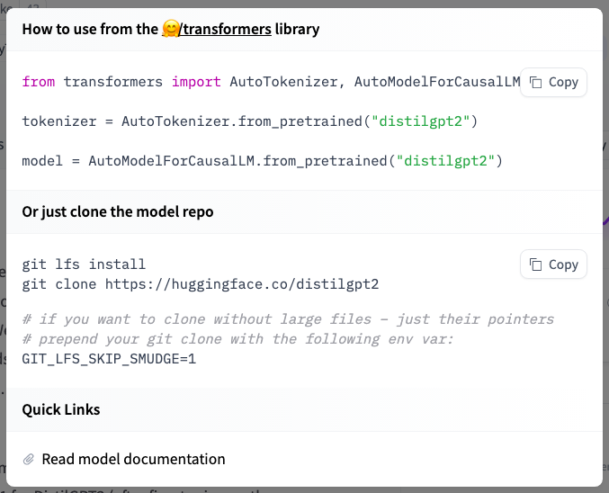
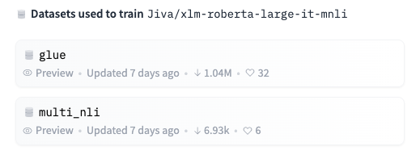

<h1>Interacting with models on the hub</h1>

## Accessing models for local use

Since all models are stored on the Model Hub as Git repositories, you can clone the models locally by running:

```bash
git lfs install
git clone <MODEL URL>
```

For detailed information on how to access the model you can click on the "Use in Transformer" button on any model page.


If the model can be used with `🤗 transformers`, you'll even receive snippets to help you get started.



### Can I access models programatically?

You can use the [`huggingface_hub`](https://github.com/huggingface/huggingface_hub) library to create, delete, update and retrieve information from repos. You can also use it to download files from repos and integrate it to your own library! For example, you can easily load a Scikit learn model with few lines.

```py
from huggingface_hub import hf_hub_url, cached_download
import joblib

REPO_ID = "YOUR_REPO_ID"
FILENAME = "sklearn_model.joblib"

model = joblib.load(cached_download(
    hf_hub_url(REPO_ID, FILENAME)
))
```

## Uploading models

The first step is to create an account at [Hugging Face](https://huggingface.co/login). The models are shared in the form of Git-based repositories which give you versioning, branches, discoverability and sharing features, integration with over a dozen libraries and more! You have control over what you want to upload to your repository, which could include checkpoints, configs and any other files.

The repository can be either linked with an individual, such as [osanseviero/fashion_brands_patterns](https://huggingface.co/osanseviero/fashion_brands_patterns) or with an organization, such as [facebook/bart-large-xsum](https://huggingface.co/facebook/bart-large-xsum). Organizations can be used if you want to upload models that are related to a company, community or library! If you choose an organization, the model will be featured on the organization’s page and every member of the organization will have the ability to contribute to the repository. You can create a new organization [here](https://huggingface.co/organizations/new).

There are several ways to upload models to the Hub, which are described below.

### Using the web interface

To create a brand new model repository, visit [huggingface.co/new](http://huggingface.co/new). Then follow these steps:

1. In the "Files and versions" tab, select "Add File" and specify "Upload File":


2. From there, select a file from your computer to upload and leave a helpful commit message to know what you are uploading:


3. Afterwards click "Commit changes" and your model will be uploaded to the Hub!

4. Inspect files and history

You can check your repository with all the recently added files!


The UI allows you to explore the model files and commits and to see the diff introduced by each commit:


5. Add metadata

You can add metadata to your model card. You can specify:
* the type of task this model is for, enabling widgets and the Inference API.
* the used library (`transformers`, `spaCy`, etc)
* the language
* the dataset
* metrics
* license
* a lot more!

Read more about model tags [here](/docs/hub/model-repos#model-card-metadata).

6. Add TensorBoard traces

Any repository that contains TensorBoard traces (filenames that contain `tfevents`) is categorized with the [`TensorBoard` tag](https://huggingface.co/models?filter=tensorboard). As a convention, we suggest that you save traces under the `runs/` subfolder. The "Training metrics" tab then makes it easy to review charts of the logged variables, like the loss or the accuracy.


Models trained with 🤗 Transformers will generate [TensorBoard traces](https://huggingface.co/transformers/main_classes/callback.html?highlight=tensorboard#transformers.integrations.TensorBoardCallback) by default if [`tensorboard`](https://pypi.org/project/tensorboard/) is installed.


### Using Git

Since model repos are just Git repositories, you can use Git to push your model files to the Hub. Follow the guide on [Getting Started with Repositories](repositories-getting-started.md) to learn about using the `git` CLI to commit and push your models.


### Using the `huggingface_hub` client library

There is a rich feature set in the `huggingface_hub` library which allows you to manage repositories, including creating repos and uploading models to the Model Hub. For more information, visit [the client library's documentation](https://huggingface.co/docs/huggingface_hub/index).


## FAQ

### How can I see what dataset was used to train the model?

It's up to the person who uploaded the model to include the training information! You may find the information about the datasets that the model was trained on in the model card. If the datasets that were used for the model are on the Hub, the uploader may have included them in the model card's metadata. In that case, the datasets would be linked with this handy card on the right side of the model page:



### How can I see an example of the model in action?

Models can have inference widgets which let you try out the model in the browser! Inference widgets are easy to configure, and there are many kinds to choose from. Visit the [Widgets documentation](models-widgets.md) to learn more.

The Hugging Face Hub is also home to Spaces, which are interactive demos that can be used to showcase models. If a model has any Spaces associated with it, they'll be linked on the model page like so:


Spaces are a great way to show off a model you've made, or to explore new ways to use existing models! Visit the [Spaces documentation](TODO) to learn all about how to make your own.

### How do I upload an update / new version of the model?

Releasing an update to a model that you've already published can be done by pushing a new commit to your model's repo. To do this, go through the same process that you followed to upload your initial model. Your previous model versions will remain in the repository as previous commits.

### What if I have a different checkpoint of the model trained on a different dataset?

By convention each model repo should contain a single checkpoint trained on a particular dataset, and any new checkpoints trained on different datasets should be uploaded to the Hub in a new model repo. You can link the models together by using a [tag in your model card's metadata](./modelcard), or by linking the in the model cards. The [akiyamasho/AnimeBackgroundGAN-Shinkai](https://huggingface.co/akiyamasho/AnimeBackgroundGAN-Shinkai#other-pre-trained-model-versions) model, for example, references other checkpoints in the model card under "Other pre-trained model versions".
